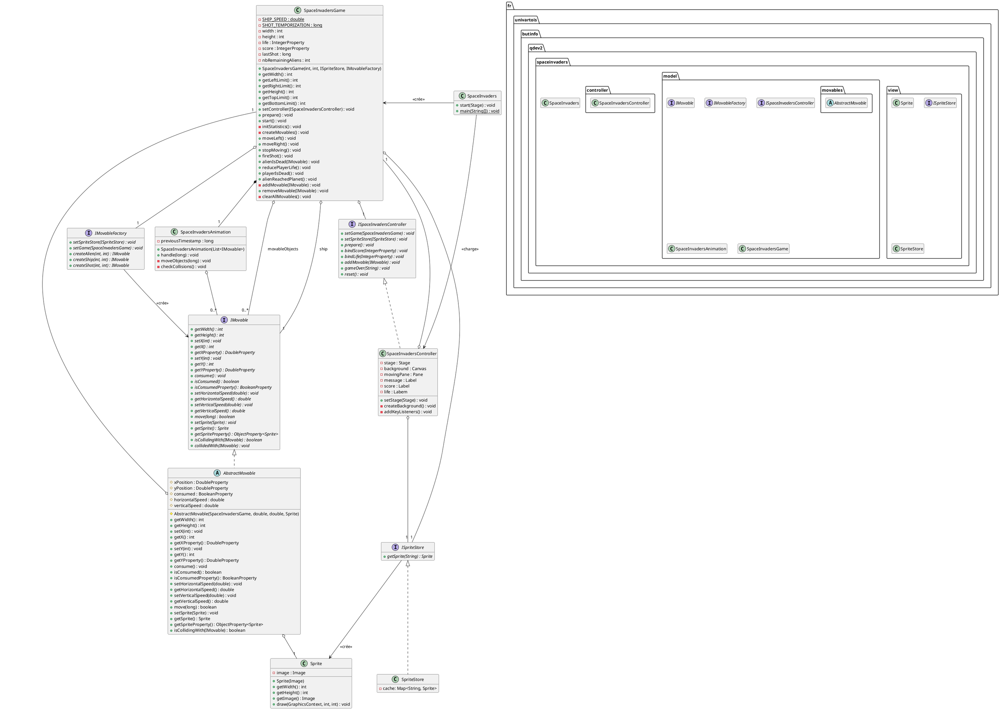

# Space-Invaders en JavaFX

## Description

Ce projet fournit une implantation de base du jeu *Space-Invaders* en *JavaFX*
Pour pouvoir développer votre propre implantation de ce projet, vous devez
en créer une **divergence** en cliquant sur le bouton `Fork` en haut à droite
de cette page.

Lorsque ce sera fait, vous pourrez inviter les membres de votre groupe en tant
que *Developer* pour vous permettre de travailler ensemble sur ce projet.

## Consignes

Vous pouvez retrouver ci-dessous les liens vers les sujets de TP vous guidant
dans le développement de votre projet.

- [Lancement du projet](https://gitlab.univ-artois.fr/enseignements-rwa/modules/but-2/q-dev-2/tp/-/tree/main/TP03)
- [Des patrons de conception dans le *Space-Invaders* (1)](https://gitlab.univ-artois.fr/enseignements-rwa/modules/but-2/q-dev-2/tp/-/tree/main/TP04)
- [Des patrons de conception dans le *Space-Invaders* (2)](https://gitlab.univ-artois.fr/enseignements-rwa/modules/but-2/q-dev-2/tp/-/tree/main/TP05)
- [Des patrons de conception dans le *Space-Invaders* (3)](https://gitlab.univ-artois.fr/enseignements-rwa/modules/but-2/q-dev-2/tp/-/tree/main/TP06)
- [Finalisation du projet *Space-Invaders*](https://gitlab.univ-artois.fr/enseignements-rwa/modules/but-2/q-dev-2/tp/-/tree/main/TP07)

## Aperçu

Le diagramme de classes ci-dessous vous donne un aperçu des fonctionnalités
disponibles dans ce projet.
N'hésitez pas à le mettre à jour dans la version dont vous disposez dans votre
propre projet, afin de permettre à votre enseignant de TP de vous faire des
retours sur vos choix de conception.
Il est en fait au format textuel (comme vous pouvez vous en rendre compte si
vous consulter le texte brut de ce document) et rendu automatiquement par
*GitLab*, ce qui devrez vous faciliter la tâche.

## Fonctionnement
- Appuyer sur la flèche du haut pour placer un mur au dessus du joueur (3 par manche)
- Appuyer sur la flèche du bas pour placer un bonus bombe au dessus du joueur. tirer sur celui-ci pour qu'il s'arrete et s'active (2 par manche)
