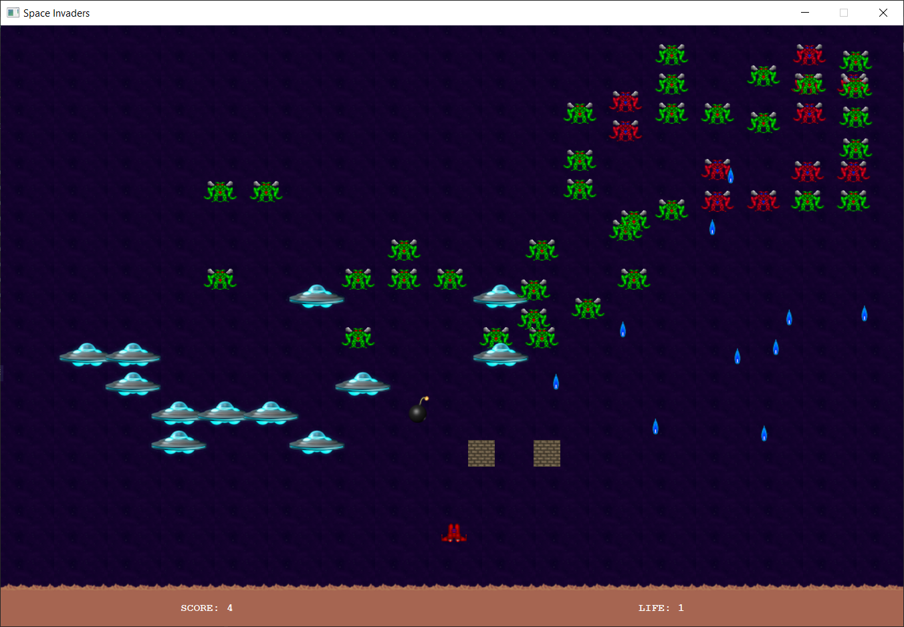

<div align="center">
  <h1 align="center">Space Invaders</h1>
    <p align="center">
    Our Space Invaders clone, built with Java & JavaFX
</div>

## About The Project

In this game, players control a spaceship to defend Earth from waves of alien invaders. The game features multiple levels, power-ups, and a scoring system. It was developed using Java 17 and JavaFX to create a responsive and interactive user interface.

## Built With

[](https://www.java.com/)  
[](https://openjfx.io/)  
[](https://gradle.org/)

## Getting Started

### Folder Structure

```markdown
SpaceInvaders/
├── 📁 src/               # Source code
│   └── 📁 main/          # Main application code
├── 📄 build.gradle       # Gradle build configuration
├── 📄 gradlew            # Unix Gradle wrapper
├── 📄 gradlew.bat        # Windows Gradle wrapper
├── 📄 settings.gradle    # Gradle settings
├── 📄 .gitignore         # Git ignore file
└── 📄 README.md          # Project documentation
```

### Prerequisites

Ensure you have the following installed:

```sh
Java 17+
Gradle
JavaFX SDK
```

### Installation & Build

1. Clone the repository:

   ```sh
   git clone https://github.com/JulesBobeuf/SpaceInvaders.git
   cd SpaceInvaders
   ```

2. Build the project using Gradle:

   ```sh
   ./gradlew build
   ```

3. Run the application:

   ```sh
   ./gradlew run
   ```

### Running the Application

After building, the application will launch the main game window where you can start playing.

## Extras

- Press the up arrow to place blocks from level 3 onward. (3 max per level)
- Press the down arrow to throw a bomb above you from level 3 onward. Ensure to shoot the bomb before it hits an alien for it to detonate! (2 max per level)

## License

This project is licensed under the MIT License. See the [LICENSE](LICENSE) file for details.

## Contact

Jules Bobeuf  
[LinkedIn](https://www.linkedin.com/in/bobeuf-jules/)  
bobeuf.jules@gmail.com

Aymeric Jakobowski  
[LinkedIn](https://www.linkedin.com/in/aymeric-jakobowski/)  
[GitHub](https://github.com/AymericJak)
