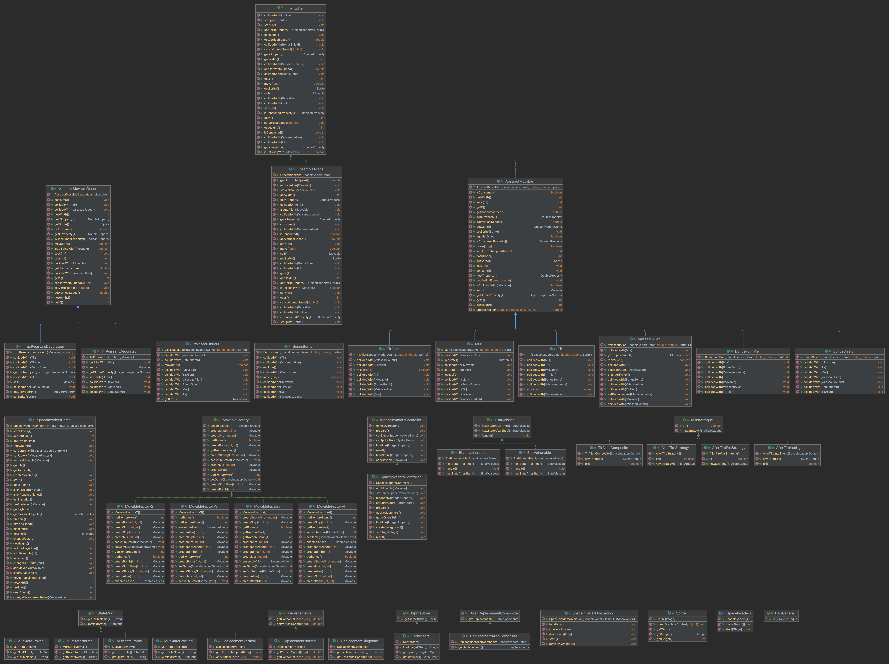

# Space-Invaders en JavaFX

## Description

Ce projet fournit une implantation de base du jeu *Space-Invaders* en *JavaFX*
Pour pouvoir développer votre propre implantation de ce projet, vous devez
en créer une **divergence** en cliquant sur le bouton `Fork` en haut à droite
de cette page.

Lorsque ce sera fait, vous pourrez inviter les membres de votre groupe en tant
que *Developer* pour vous permettre de travailler ensemble sur ce projet.

## Consignes

Vous pouvez retrouver ci-dessous les liens vers les sujets de TP vous guidant
dans le développement de votre projet.

- [Lancement du projet](https://gitlab.univ-artois.fr/enseignements-rwa/modules/but-2/q-dev-2/tp/-/tree/main/TP03)
- [Des patrons de conception dans le *Space-Invaders* (1)](https://gitlab.univ-artois.fr/enseignements-rwa/modules/but-2/q-dev-2/tp/-/tree/main/TP04)
- [Des patrons de conception dans le *Space-Invaders* (2)](https://gitlab.univ-artois.fr/enseignements-rwa/modules/but-2/q-dev-2/tp/-/tree/main/TP05)
- [Des patrons de conception dans le *Space-Invaders* (3)](https://gitlab.univ-artois.fr/enseignements-rwa/modules/but-2/q-dev-2/tp/-/tree/main/TP06)
- [Finalisation du projet *Space-Invaders*](https://gitlab.univ-artois.fr/enseignements-rwa/modules/but-2/q-dev-2/tp/-/tree/main/TP07)

## Mise en garde

Il y a des bugs en lien avec la classe `EnsembleAliens`, le déplacement en escadrille n'est donc pas implémenté dans le jeu. Néanmoins, la méthode permettant de l'implémenter se retrouve en commentaire. Le jeu est donc jouable !

## Aperçu

## Fonctionnement
- Appuyer sur la flèche du haut pour placer un mur au dessus du joueur (3 par manche)
- Appuyer sur la flèche du bas pour placer un bonus bombe au dessus du joueur. tirer sur celui-ci pour qu'il s'arrete et s'active (2 par manche)
